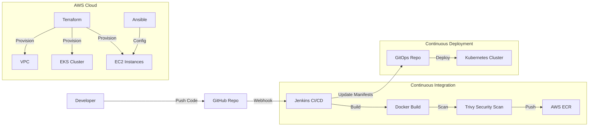

# 🚀 Final Project - DevOps & Automation Track


## 📋 Table of Contents
- [Project Overview](#-project-overview)
- [Architecture](#-architecture)
- [Key Features](#-key-features)
- [Technology Stack](#-technology-stack)
- [Prerequisites](#-prerequisites)
- [Installation & Setup](#-installation--setup)
- [CI/CD Pipeline](#-cicd-pipeline)
- [Author](#-author)

## 📖 Project Overview

This repository hosts the **Final Project** for the **DevOps & Automation** training at NTI. It demonstrates a complete, production-grade DevOps lifecycle implementation, solving real-world challenges through automation, containerization, and orchestration.

The project integrates a robust toolchain including **Jenkins** for CI/CD, **Docker** for containerization, **Kubernetes (EKS)** for orchestration, and **Terraform** for Infrastructure as Code (IaC), ensuring a scalable, reliable, and automated deployment process.

## 🏗 Architecture

The following diagram illustrates the automated workflow and infrastructure components:



## ✨ Key Features

- **Infrastructure as Code (IaC)**: Complete infrastructure provisioning on AWS using **Terraform**.
- **Configuration Management**: Server configuration and automated setup using **Ansible**.
- **Containerization**: Microservices architecture fully containerized using **Docker**.
- **Orchestration**: High-availability deployment on **AWS EKS** (Elastic Kubernetes Service).
- **CI/CD Automation**: Fully automated pipeline using **Jenkins**:
    - Automatic builds on git push.
    - Security scanning with **Trivy**.
    - Artifact management with **AWS ECR**.
    - Continuous deployment to Kubernetes.
- **Monitoring & Logging**: Integrated CloudWatch agents and monitoring stack.
- **Security**: Automated vulnerability scanning and secure credential management.

## 🛠 Technology Stack

| Category | Technology |
|----------|------------|
| **Cloud Provider** | AWS (EC2, EKS, ECR, VPC, IAM) |
| **IaC** | Terraform |
| **Config Mgmt** | Ansible |
| **Orchestration** | Kubernetes |
| **CI/CD** | Jenkins |
| **Containerization** | Docker |
| **Security** | Trivy |
| **Languages** | Node.js (Backend), React (Frontend) |

## ⚙ Prerequisites

Before running this project, ensure you have the following installed:

- [Docker](https://docs.docker.com/get-docker/)
- [AWS CLI](https://aws.amazon.com/cli/) (configured with credentials)
- [Terraform](https://www.terraform.io/downloads.html)
- [Ansible](https://docs.ansible.com/ansible/latest/installation_guide/intro_installation.html)
- [kubectl](https://kubernetes.io/docs/tasks/tools/)

## 🚀 Installation & Setup

### 1. Clone the Repository
```bash
git clone https://github.com/Ammar-Abdelhady-ai/FinalProject_NTI.git
cd FinalProject_NTI
```

### 2. Local Development (Docker Compose)
To run the full stack locally:
```bash
docker-compose up --build -d
```
Access the application at `http://localhost:8080`.

### 3. Infrastructure Provisioning
Navigate to the infrastructure directory and apply Terraform configuration:
```bash
cd "Infrastructure Code"
terraform init
terraform apply --auto-approve
```

### 4. Configuration
Run Ansible playbooks to configure instances:
```bash
cd ../ansible
ansible-playbook -i inventory playbooks/main.yml
```

## 🔄 CI/CD Pipeline

The `Jenkinsfile` defines the following stages:
1.  **Checkout**: Pulls the latest code from GitHub.
2.  **Build**: Creates Docker images for Frontend and Backend.
3.  **Security Scan**: Runs Trivy to identify vulnerabilities.
4.  **Push**: Uploads images to AWS ECR.
5.  **Deploy**: Updates Kubernetes manifests to trigger deployment on EKS.

## 👤 Author

**Ammar Abdelhady**

*   **GitHub**: [Ammar-Abdelhady-ai](https://github.com/Ammar-Abdelhady-ai)
*   **Role**: DevOps Engineer